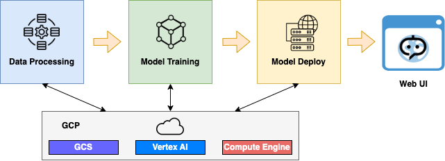
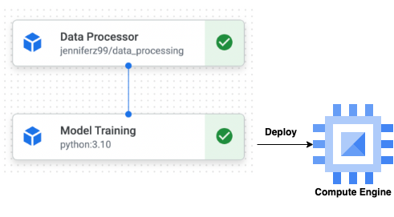
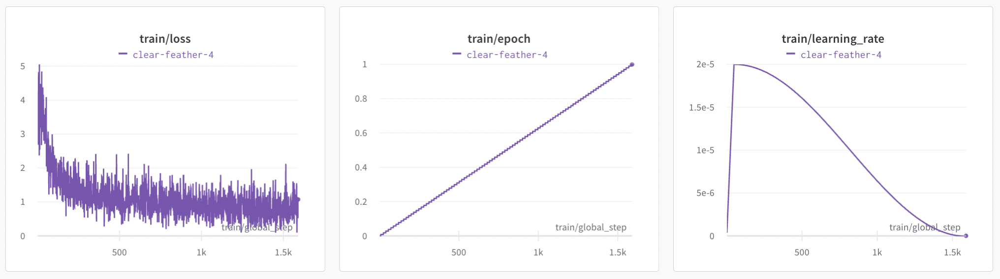
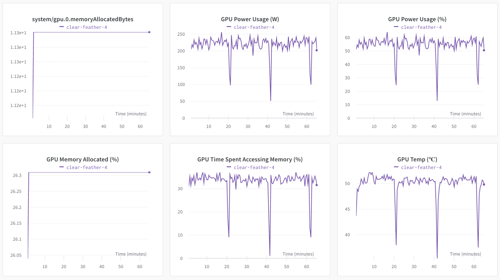
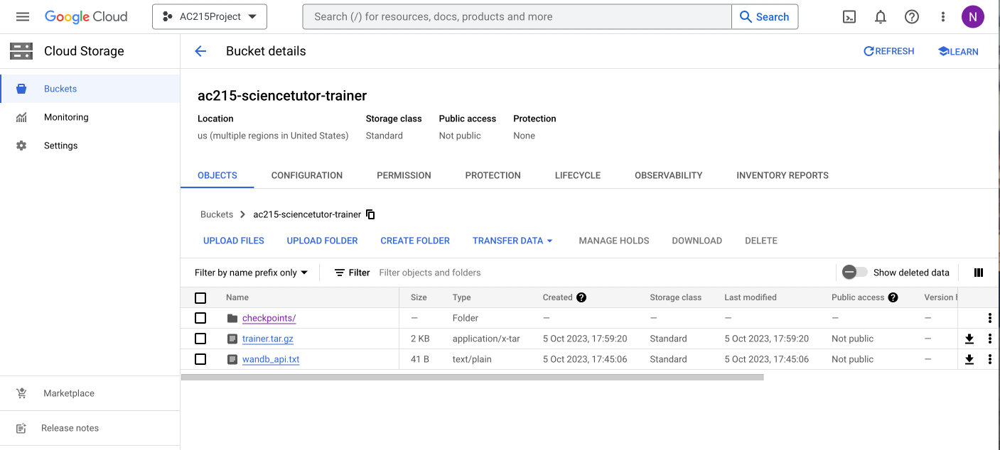
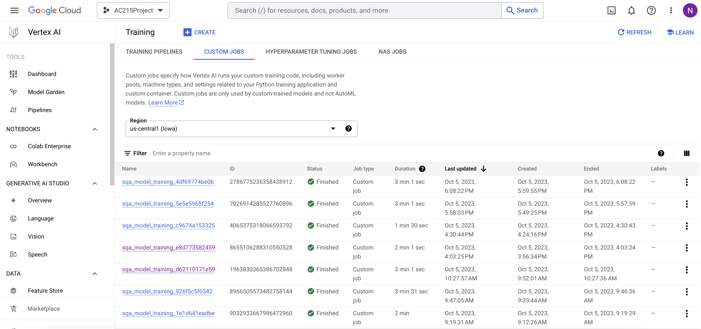
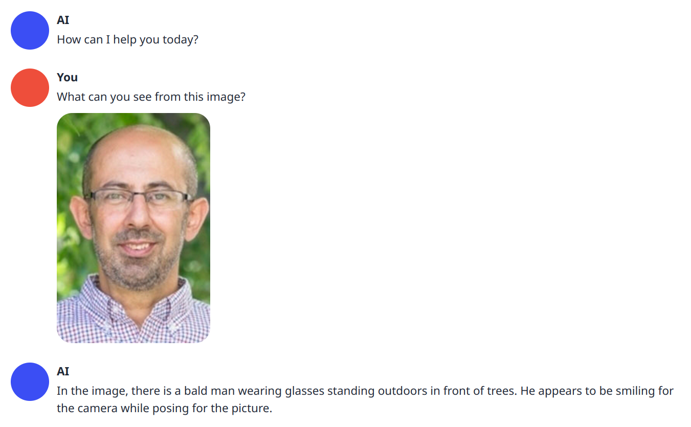
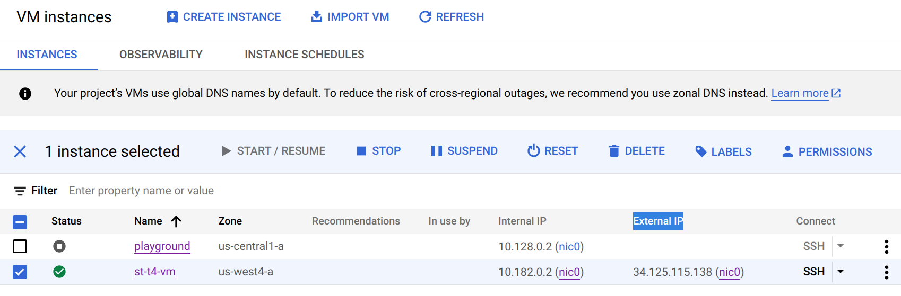

# AC215 - ScienceTutor

## Application Pipeline Flow


## Vertex AI Pipeline for ML Workflow


## Project Organization
      .
      ├── LICENSE
      ├── README.md
      ├── notebooks
      │   └── AC215_milestone3_model_training.ipynb
      ├── pictures
      │   ├── compute_engine.png
      │   ├── gcs_model_bucket.png
      │   ├── ml_workflow.png
      │   ├── science_tutor_app_pipeline.png
      │   ├── science_tutor_app_pipeline2.png
      │   ├── vertex_ai_model_training.png
      │   ├── wandb_system.png
      │   ├── wandb_train.png
      │   └── web_server_demo.png
      ├── references
      ├── reports
      └── src
            ├── data_processing
            │   ├── Dockerfile
            │   ├── docker-shell.sh
            │   ├── convert_scienceqa_to_llava.py
            │   ├── ScienceQA-LLAVA.dvc
            │   ├── upload_to_gcs.py
            │   ├── upload_to_hf.py
            │   ├── utils.py
            │   └── requirements.txt
            ├── model_training
            │   ├── package
            │   │   ├── trainer
            │   │   │   ├── __init__.py
            │   │   │   ├── task.py
            │   │   │   └── wandb_api.py
            │   │   ├── PKG-INFO
            │   │   ├── setup.cfg
            │   │   └── setup.py
            │   ├── Dockerfile
            │   ├── Pipfile
            │   ├── Pipfile.lock
            │   ├── cli.sh
            │   ├── docker-entrypoint.sh
            │   ├── docker-shell.sh
            │   ├── download_from_gcs.py
            │   ├── download_from_hf.py
            │   ├── package-trainer.sh
            │   ├── Pipfile.lock
            │   ├── upload_model_to_gcs.py
            │   └── upload_trainer_to_gcs.py
            ├── ml_workflow
            │   ├── Dockerfile
            │   ├── Pipfile
            │   ├── Pipfile.lock
            │   ├── cli.py
            │   ├── docker-entrypoint.sh
            │   ├── docker-shell.sh
            │   ├── model.py
            │   ├── model_training.yaml
            │   └── pipeline.yaml
            ├── model_inference
            │   ├── compute_metric.py
            │   └── model_vqa_science.py
            └── model_deploy
                ├── api_example
                │   ├── req.json
                │   └── websocket_streaming.py
                ├── Dockerfile
                ├── docker-shell.sh
                └── failed_vertex_ai_script.py


## AC215 - Milestone4 - ScienceTutor

**Team Members** Sijia (Nancy) Li, Ziqing Luo, Yuqing Pan, Jiashu Xu, Xiaohan Zhao

**Group Name** Science Tutor

**Project** In this project we aim to develop an educational application that provides instant and expert answers to science questions that children have in different domains such as natural, social and language science.

### Milestone4
In milestone4, we developed an ML workflow on Google Cloud Platform (GCP). We created a script to call the `data_processing` and `model_training` tasks, as well as running these tasks. We have been adviced that Vertex AI pipeline is not suitable for model deployment for our project as we have our own service and API, like a web server. Since GCP Cloud Run does not support GPU, we deployed our model using GCP Compute Engine. Model deployment details can be found in the **Model Deployment** section of the README below. 

Regarding the modeling process, we tried various optimization techniques to reduce memory usage. We also performed model inference by evaluating the model's performance on the test set of ScienceQA. We achieved a test accuracy of 65.53%.


## Model Training
We forked the LLaVA repository and [updated the code for passing in the ScienceQA that we preprocessed](https://github.com/cnut1648/LLaVA). By doing this, we customized the model to take into our own preprocessed ScienceQA dataset. 

Regarding the modeling process, we tried several optimization techniques to reduce memory usage: 
- bf16
- deepspeed ZERO-2 for multi-GPU
- gradient checkpointing
- gradient accumulation
- tf32

In our colab version, we use all those optimization techniques with A100 GPU except deepspeed as we can only access 1 GPU. For Vertex AI, Google approved our request for 4 NVIDIA_TESLA_V100 GPU but we do not have NVIDIA_TESLA_A100 GPU:
V100 unfortunately does not support bf16. We tried fp16 but due to Huggingface implementation of LLaMA (model that LLaVA is based on), there is a data type conversion error in attention computation with fp16. Moreover, tf32 is also not supported. We found that we cannot load the model into the memory using 4 V100 on Vertex AI, let alone training it.

## Experiment Tracking

The images below show the training output from our Weights & Biases Page. The Weights & Biases Page tracks our model training process. This is done by using the `wandb` library that we included in our `task.py` Python script.

Train Tracking:


System Tracking:


## Serverless Training

There are three main steps to launch training instances in the cloud: (1) run and build model training container, (2) package model training code and upload into a bucket in Google Cloud Storage, and (3) run the model on Vertex AI. 

To create a new serverless job we did the following commands:
```shell
cd src/model_training
sh docker-shell.sh
sh package-trainer.sh
sh cli.sh
```

Google Cloud Storage Bucket with our training code stored in `trainer.tar.gz`:


Vertex AI showing our attempts for model training (currently we are still restricted by Vertex AI's GPU quota and cannot load our model into memory):


## Dataset Evaluation

We have trained the model on ScienceQA, and to evaluate our model performance on science domain, we provice code to evaluate on the testset of ScienceQA, which contains 4241 instances.

```shell
cd src/model_inference;
git clone https://github.com/cnut1648/LLaVA.git # our forked repo

# this will cache inference results in `src/model_inference/scienceqa-eval.jsonl`
PYTHONPATH=LLaVA python -m model_vqa_science \
    --model-path <your llava model> \
    --single-pred-prompt \
    --temperature 0 \
    --conv-mode vicuna_v1

python compute_metric.py
```
Our code supports multi-GPU inference, simply set your `CUDA_VISIBLE_DEVICES` environment variable to the GPUs you want to use. For example, to use GPU 0 and 1, run `CUDA_VISIBLE_DEVICES=0,1 python -m model_vqa_science ...`.

For our 7B model, the performance is
```
Total: 4241, Correct: 2779, Accuracy: 65.53%, IMG-Accuracy: 63.86%
```
which is pretty close to the performance reported by the LLaVA 13B (~70%). Note that that is a larger model with a possibly more careful hyperparameter tuning while we only train for one epoch with a default hyperparameter.

## Model Deploy
We have deployed our model such that user can interact with our model through a web interface. In `model_deploy/` directory, you can build the `Dockerfile`.
We have configurated the UI such that
- It supports multi-GPU inference. It will dynamically allocate GPUs memory available to your system.   
- It loads the 4bit quantized model to further reduce the memory usage.
- The model it loaded is our LLaVA 7b model.
- We export port 7860 for the web server. 
 
To run the container, you need to install a GPU-enabled toolkit. For example, on Arch Linux it is [nvidia-container-toolkit](https://aur.archlinux.org/packages/nvidia-container-toolkit/).
```shell
docker build -t ui .

# use all your GPUs 
# it will hang, until you manually terminate the container
# access the web server at http://localhost:7860
docker run --gpus all -p 7860:7860 -t ui
```
An example conversation with our model is shown below:


For online deployment, we have attempted to deploy our model on Vertex AI Endpoint, via the script in [`src/src/model_deploy/failed_vertex_ai_script.py`](src/model_deploy/failed_vertex_ai_script.py).
However we are advised by Shivas that Vertex AI is not suitable for our use case, because Vertex AI takes only a model and build the API endpoint for you while we have our own service and API, like a web server.
We are then suggested to try compute engine or cloud run. However there is no GPU support for cloud run, so as a workaround, we use compute engine instead.

In this project we deploy our model, as well as the Web UI on Google compute engine, where instance starts from our customized docker:

As we quantized our model, we have successfully reduced the memory usage and are able to deployed our model on a T4 GPU with n1-highmem-2 instance.
Note that there is an external IP assigned, so that user can directly go to `http://34.125.115.138:7860/` to access our service.
We have stopped the instance to save cost as keeping it running all day would quickly exhaust our credits. Please contact us if you want to try it out, and we will start the instance for you.

Alternatively, our docker also supports handling direct requests. For example, you can create a `req.json` like this (checkout [`src/model_deploy/api_example/req.json`](src/model_deploy/api_example/req.json)):
```json
{
    "prompt": "Put an elephant in a fridge in three steps:\n1)",
    "seed": 2
}
```
And then ask the model to complete the three steps to put an elephant in a fridge:
```shell
curl -X POST -d "@req.json" -H "Content-Type: application/json" http://34.125.115.138:5000/api/v1/generate
# an example model output
# {"results": [{"text": " Open the refrigerator door.\n2) Place the elephant inside the refrigerator.\n3) Close the refrigerator door."}]}
```

Or, if user prefer streaming API via websocket, you can use the python code in [`src/model_deploy/api_example/websocket_streaming.py`](src/model_deploy/api_example/websocket_streaming.py) to interact with our model.
The output will be generated in a stream, similar to ChatGPT interface.

## Code Structure

### notebooks
This folder contains code that is not part of container, for example, model training testing code for debugging purposes.

[`notebooks/AC215_milestone3_model_training.ipynb`](notebooks/AC215_milestone3_model_training.ipynb): This notebook includes the code we used for training our model on Colab.

### src
This folder contains the development code for the ScienceTutor application.

#### (1) Data Processing Container
- This container loads the dataset from huggingface, and convert each data instance into LLaVA format to enforce format consistency as LLaVA training format.
- This container will store the reformatted dataset, so that user can retrieve the dataset to (1) use for training (2) upload to GCP, huggingface etc, your choice.

(1) [`src/data_processing/convert_scienceqa_to_llava.py`](src/data_processing/convert_scienceqa_to_llava.py): This script converts the ScienceQA dataset downloaded from Huggingface into the data format that can be passed into the LLaVA model.

(2) [`src/data_processing/requirements.txt`](src/data_processing/requirements.txt): This file specifies the packages required to be installed.

(3) [`src/data_processing/Dockerfile`](src/data_processing/Dockerfile): This is the Dockerfile to build the container.

(4) [`src/data_processing/upload_to_hf.py`](src/data_processing/upload_to_hf.py): This script uploads the data to Huggingface as a private dataset.

(5) [`src/data_processing/upload_to_gcs.py`](src/data_processing/upload_to_gcs.py): This script uploads the data to Google Cloud Storage.

However, as mentioned in [Data Versioning](#data-versioning), we use `dvc` to version control the dataset. You can simply `dvc pull` to obtain the processed dataset, and can safely skip the rest of this section.

To run Dockerfile:
```shell
cd src/data_processing;
# build docker
docker build .
# ...
# Successfully built b0d701fb573e

# run container from image
docker run -it -d b0d701fb573e
# get container id
docker ps
# to explore dataset and use dataset
docker exec -it <container_id> bash
# OR
# to copy to host
# reformatted dataset
docker cp <container_id>:/usr/src/app/ScienceQA-LLAVA ./ScienceQA-LLAVA
# original dataset
docker cp <container_id>:/usr/src/app/ScienceQA ./ScienceQA
```

To upload to huggingface/GCS, first create a `.env` as follows:
```
HF_TOKEN=<YOUR HUGGINGFACE TOKEN>
GOOGLE_APPLICATION_CREDENTIALS=<PATH TO SERVICE ACCOUNT CREDENTIALS>
```
Then `python upload_to_hf.py` to upload to huggingface as a private dataset; or 
`python upload_to_gcs.py` to upload to GCS.

To ease development, we have uploaded the reformatted dataset to

- Huggingface: [`cnut1648/ScienceQA-LLAVA`](https://huggingface.co/datasets/cnut1648/ScienceQA-LLAVA/).
- GCS: [`gs://ac215-sciencetutor/ScienceQA-LLAVA`](https://console.cloud.google.com/storage/browser/ac215-sciencetutor/ScienceQA-LLAVA). For TA, please contact us for access.

##### Data Versioning
We additionally use `dvc` to version control the dataset. Specifically, `src/data_processing/ScienceQA-LLAVA.dvc` is the dvc file that tracks the reformatted dataset. The data is remotely tracked in GCS. To download the dataset, run `dvc pull` after cloning the repo.

#### (2) Model Training Container
This container will download the processed dataset and train the LLaVA model. The trained LLaVA model will be used in the chatbot logic component to perform the visual question answering (VQA) task. 

To build and run the container, package the model training code, and send job to Vertex AI:
```shell
cd src/model_training
sh docker-shell.sh
sh package-trainer.sh
sh cli.sh
```

Files for downloading the datasets:

(1) [`src/model_training/download_from_hf.py`](src/model_training/download_from_hf.py): This script downloads the dataset from Huggingface.

(2) [`src/model_training/download_from_gcs.py`](src/model_training/download_from_gcs.py): This script downloads the dataset from Google Cloud Storage.

(3) [`src/model_training/Dockerfile`](src/model_training/Dockerfile), [`src/model_training/Pipfile`](src/model_training/Pipfile), [`src/model_training/Pipfile.lock`](src/model_training/Pipfile.lock), [`src/model_training/docker-entrypoint.sh`](src/model_training/docker-entrypoint.sh), [`src/model_training/docker-shell.sh`](src/model_training/docker-shell.sh): These are the files to build and run the container.

(4) [`src/model_training/package/`](src/model_training/package/): This is the folder that contains the model training code and wandb_api_key upload code.

(5) [`src/model_training/package-trainer.sh`](src/model_training/package-trainer.sh): This is the script for packaging the model training code into `trainer.tar.gz`.

(6) [`src/model_training/upload_trainer_to_gcs.py`](src/model_training/upload_trainer_to_gcs.py): This script uploads the `trainer.tar.gz` containing the model training code to Google Cloud Storage Bucket.

(7) [`src/model_training/upload_model_to_gcs.py`](src/model_training/upload_model_to_gcs.py): This script uploads the `checkpoints` folder containing the trained model checkpoints to Google Cloud Storage Bucket. 

(8) [`src/model_training/cli.py`](src/model_training/cli.py), [`src/model_training/cli.sh`](src/model_training/cli.sh): These are the scripts for command-line interface (CLI) to create custom model training jobs on Vertex AI. 


#### (3) ML Workflow Container
This container contains will build the ML workflow on Vertex Ai pipeline for data processing and model training. 

To build and run the container, and run the ML workflow on Vertex AI:
```shell
cd src/ml_workflow
sh docker-shell.sh
python3 cli.py -p # Run just the Data Processor
python3 cli.py -t # Run just Model Training
python3 cli.py -w # Run the ScienceTutor App Pipeline (Data Processor and Model Training)
```

(1) [`src/ml_workflow/cli.py`](src/ml_workflow/cli.py): The CLI to test creation and execution of pipelines.

(2) [`src/ml_workflow/model_training.yaml`](src/ml_workflow/model_training.yaml), [`src/ml_workflow/pipeline.yaml`](src/ml_workflow/pipeline.yaml): The generated pipeline definition files.

(3) [`src/ml_workflow/Dockerfile`](src/ml_workflow/Dockerfile), [`src/ml_workflow/Pipfile`](src/ml_workflow/Pipfile), [`src/ml_workflow/Pipfile.lock`](src/ml_workflow/Pipfile.lock), [`src/ml_workflow/docker-entrypoint.sh`](src/ml_workflow/docker-entrypoint.sh), [`src/ml_workflow/docker-shell.sh`](src/ml_workflow/docker-shell.sh): These are the files to build and run the container.


#### (4) Model Deploy Container
This container contains the code for deploying our Science Tutor chatbot application on GCP Compute Engine. Our custom container also supports handling direct requests via a json file or streaming API via websocket.

To build and run the container:
```shell
cd src/model_deploy
sh docker-shell.sh
```

(1) [`src/api_example/`](src/api_example/): This folder contains an example of streaming API via websocket.

(2) [`src/model_deploy/Dockerfile`](src/model_deploy/Dockerfile), [`src/model_deploy/docker-shell.sh`](src/model_deploy/docker-shell.sh): These are the files for building and running the container.


#### (5) Other Containers
In addition to the existing containers, we may consider incorporating additional containers as the need arises. This may include a database container for the storage of user message data, and a recommendation engine container housing the logic for recommending posts or videos based on the questions user asked.


#### (6) Other Source Code
##### Model Inference
[`src/model_inference/compute_metric.py`](src/model_inference/compute_metric.py), [`src/model_inference/model_vqa_science.py`](src/model_inference/model_vqa_science.py): Using these two scripts, we perform model inference on the test set of ScienceQA to examine the performance of our LLaVA-7B model finefuned on the science domain. 
