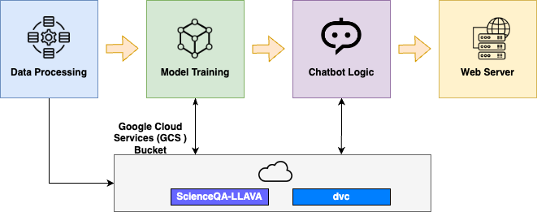

# AC215 - Milestone2 - ScienceTutor

**Team Members**
Sijia (Nancy) Li, Ziqing Luo, Yuqing Pan, Jiashu Xu, Xiaohan Zhao

**Group Name**
Science Tutor

**Project**
In this project we aim to develop an educational application that provides instant and expert answers to science questions that children have in different domains such as natural, social and language science.

The app pipeline flow is as shown:



## Project Organization

      ├── LICENSE
      ├── README.md
      ├── notebooks
      ├── references
      ├── requirements.txt
      ├── setup.py
      └── src
            ├── data_processing
            │   ├── Dockerfile
            │   ├── data_processing.py
            │   └── requirements.txt
            ├── model_training
            │   ├── Dockerfile
            │   ├── model_training.py
            │   └── requirements.txt
            ├── chatbot_logic
            │   ├── Dockerfile
            │   ├── docker-shell.sh
            │   ├── Pipfile
            │   └── Pipfile.lock
            └── web_server
                ├── Dockerfile
                ├── docker-shell.sh
                ├── Pipfile
                └── Pipfile.lock

## Milestone2

We will use [ScienceQA](https://scienceqa.github.io/#dataset), which is a public dataset that consists of ~21k multimodal multiple choice questions covering a diverse set of science topics. The dataset is available at [Hugging Face](https://huggingface.co/datasets/derek-thomas/ScienceQA).

### Data Processing Container
- The container load dataset from huggingface, and convert each data instance into LLaVA format to enforce format consistency as LLaVA training format.
- The container will store the reformatted dataset, so that user can retrieve the dataset to (1) use for training (2) upload to GCP, huggingface etc, your choice.

(1) [`src/data_processing/convert_scienceqa_to_llava.py`](src/data_processing/convert_scienceqa_to_llava.py): conversion code

(2) [`src/data_processing/requirements.txt`](src/data_processing/requirements.txt): required packages

(3) [`src/data_processing/Dockerfile`](src/data_processing/Dockerfile): Dockerfile to build the container

(4) [`src/data_processing/upload_to_hf.py`](src/data_processing/upload_to_hf.py): upload to huggingface as private dataset

(5) [`src/data_processing/upload_to_gcs.py`](src/data_processing/upload_to_gcs.py): upload to Google Cloud Storage.

However, as mentioned in [Data Versioning](#data-versioning), we use `dvc` to version control the dataset.
You can simply `dvc pull` to obtain the processed dataset, and can safely skip the rest of this section.

To run Dockerfile:
```shell
cd src/data_processing;
# build docker
docker build .
# ...
# Successfully built b0d701fb573e

# run container from image
docker run -it -d b0d701fb573e
# get container id
docker ps
# to explore dataset and use dataset
docker exec -it <container_id> bash
# OR
# to copy to host
# reformatted dataset
docker cp <container_id>:/usr/src/app/ScienceQA-LLAVA ./ScienceQA-LLAVA
# original dataset
docker cp <container_id>:/usr/src/app/ScienceQA ./ScienceQA
```

To upload to huggingface/GCS, first create a `.env` as follows:
```
HF_TOKEN=<YOUR HUGGINGFACE TOKEN>
GOOGLE_APPLICATION_CREDENTIALS=<PATH TO SERVICE ACCOUNT CREDENTIALS>
```
Then `python upload_to_hf.py` to upload to huggingface as a private dataset; or 
`python upload_to_gcs.py` to upload to GCS.

To ease development, we have uploaded the reformatted dataset to

- Huggingface: [`cnut1648/ScienceQA-LLAVA`](https://huggingface.co/datasets/cnut1648/ScienceQA-LLAVA/).
- GCS: [`gs://ac215-sciencetutor/ScienceQA-LLAVA`](https://console.cloud.google.com/storage/browser/ac215-sciencetutor/ScienceQA-LLAVA). For TA, please contact us for access.

#### Data Versioning
We additionally use `dvc` to version control the dataset.
Specifically, `src/data_processing/ScienceQA-LLAVA.dvc` is the dvc file that tracks the reformatted dataset. 
The data is remotely tracked in GCS.
To download the dataset, run `dvc pull` after cloning the repo.

### Model Training Container
This container will download the processed dataset and train the LLaVA model. The trained LLaVA model will be used in the chatbot logic component to perform the visual question answering (VQA) task. 

(1) [`src/model_training/docker-shell.sh`](src/model_training/docker-shell.sh): shell script to automatically build and run the container using `./docker-shell.sh`

(2) [`src/model_training/Dockerfile`](src/model_training/Dockerfile): Dockerfile to build the container

(3) [`src/model_training/download_from_hf.py`](src/model_training/download_from_hf.py): download the dataset from huggingface

(4) [`src/model_training/download_from_gcs.py`](src/model_training/download_from_gcs.py): download the dataset from Google Cloud Storage

In this milestone, it is a placeholder for future implementation.

### Web Server Container
This container serves as the frontend of our Science Tutor chatbot application. 
It handles HTTP requests, provides a user interface, and communicates with the chatbot logic component.

To build and run the container:
```shell
cd src/web_server;
sh docker-shell.sh
```

In this milestone, it is a placeholder for future implementation.

### Chatbot Logic Container
This container contains the core chatbot logic. 
It processes user messages received from the web server container, conducts inference with the model API and generates responses.

To build and run the container:
```shell
cd src/chatbot_logic;
sh docker-shell.sh
```

In this milestone, it is a placeholder for future implementation.

### Other Containers
In addition to the existing containers, we may consider incorporating additional containers as the need arises. 
This may include a database container for the storage of user message data, and a recommendation engine container housing the logic for recommending posts or videos based on the questions user asked.