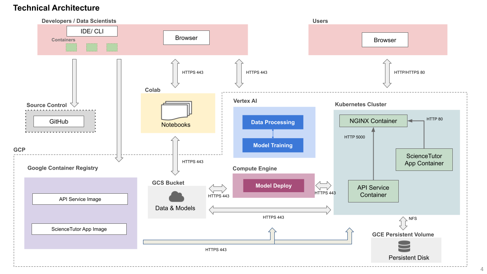
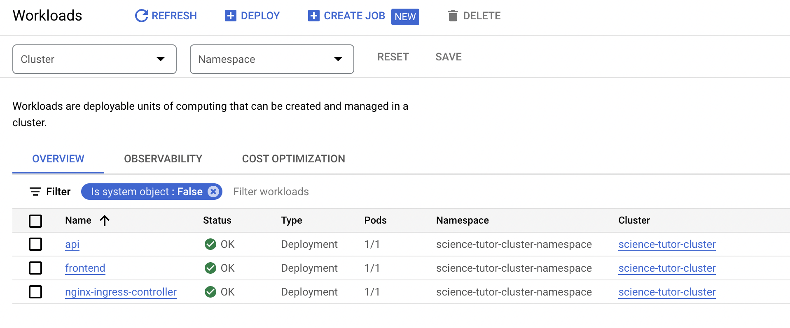
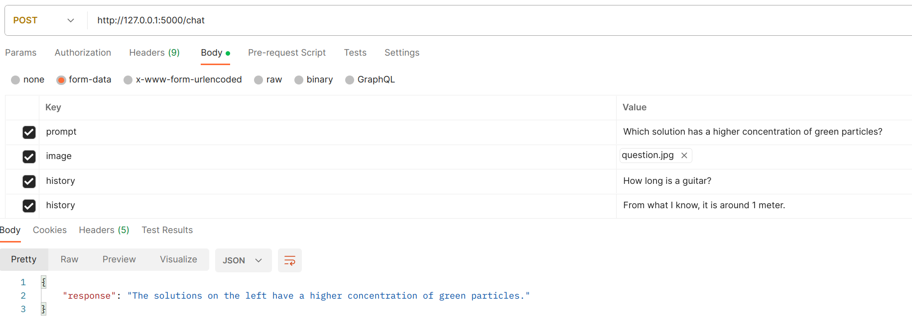

# AC215 - ScienceTutor

## Project Organization
      .
      ├── LICENSE
      ├── README.md
      ├── notebooks
      │   └── AC215_milestone3_model_training.ipynb
      ├── pictures
      │   ├── compute_engine.png
      │   ├── gcs_model_bucket.png
      │   ├── ml_workflow.png
      │   ├── ml_workflow_pipeline_run.png
      │   ├── science_tutor_app_pipeline.png
      │   ├── science_tutor_app_pipeline2.png
      │   ├── vertex_ai_model_training.png
      │   ├── wandb_system.png
      │   ├── wandb_train.png
      │   └── web_server_demo.png
      ├── references
      ├── reports
      └── src
            ├── data_processing
            │   ├── Dockerfile
            │   ├── docker-shell.sh
            │   ├── convert_scienceqa_to_llava.py
            │   ├── ScienceQA-LLAVA.dvc
            │   ├── upload_to_gcs.py
            │   ├── upload_to_hf.py
            │   ├── utils.py
            │   └── requirements.txt
            ├── model_training
            │   ├── package
            │   │   ├── trainer
            │   │   │   ├── __init__.py
            │   │   │   ├── task.py
            │   │   │   └── wandb_api.py
            │   │   ├── PKG-INFO
            │   │   ├── setup.cfg
            │   │   └── setup.py
            │   ├── Dockerfile
            │   ├── Pipfile
            │   ├── Pipfile.lock
            │   ├── cli.sh
            │   ├── docker-entrypoint.sh
            │   ├── docker-shell.sh
            │   ├── download_from_gcs.py
            │   ├── download_from_hf.py
            │   ├── package-trainer.sh
            │   ├── Pipfile.lock
            │   ├── upload_model_to_gcs.py
            │   └── upload_trainer_to_gcs.py
            ├── ml_workflow
            │   ├── Dockerfile
            │   ├── Pipfile
            │   ├── Pipfile.lock
            │   ├── cli.py
            │   ├── docker-entrypoint.sh
            │   ├── docker-shell.sh
            │   ├── model.py
            │   ├── model_training.yaml
            │   └── pipeline.yaml
            ├── model_inference
            │   ├── compute_metric.py
            │   └── model_vqa_science.py
            └── model_deploy
                ├── api_example
                │   ├── req.json
                │   └── websocket_streaming.py
                ├── Dockerfile
                ├── docker-shell.sh
                └── failed_vertex_ai_script.py


## AC215 - Milestone5 - ScienceTutor

**Team Members** Sijia (Nancy) Li, Ziqing Luo, Yuqing Pan, Jiashu Xu, Xiaohan Zhao

**Group Name** Science Tutor

**Project** In this project we aim to develop an educational application that provides instant and expert answers to science questions that children have in different domains such as natural, social and language science.

### Milestone5
After completions of building a robust ML Pipeline in our previous milestone we have built a backend api service using Flask and a frontend web app using React. 
This will be our user-facing application that ties together the various components built in previous milestones.

## Application Design
Before we start implementing the app we built a detailed design document outlining the application’s architecture. 
We built a Solution Architecture abd Technical Architecture to ensure all our components work together.

### Solution Architecture


### Technical Architecture


### Backend API


### Frontend


### Deployment
We used Ansible and Kubernetes to create, provision, and deploy our frontend and backend to GCP in an automated fashion.

We successfully created the Kubernetes cluster for our app in GCP:


We can interact with the chatbot in our web browser:


## Code Structure

The following are the folders from the previous milestones:
```
- data_processing
- model_training
- model_inference
- model_deploy
- ml_workflow
```

### API Service Container
In `src/backend` directory, you can launch the backend server by running `python model_backend.py`. It will start a flask server at `http://localhost:5000/`. It will serve as the backend for our web UI.
We also provide Dockerfile for the backend server, and you can build it via the following commands in the `src/api-service` directory:
```shell
# build docker
docker build . -t backend

# use all your GPUs 
# it will hang, until you manually terminate the container
# access the backend endpoint at http://localhost:5000/chat
docker run --gpus all -p 5000:5000 -t backend
```

Currently there is a `/chat` endpoint with `POST` method. You can check `/apidocs` for Swagger UI API docs.


It is advised to use postman to test the API.


### Frontend Container

### Deployment Container

This container helps manage building and deploying all our app containers. 
This can be achieved with Ansible, with or without Kubernetes.

To run the container locally:
- Open a terminal and go to the location `AC215_ScienceTutor/src/app_deploy`
- Run `sh docker-shell.sh`

#### Deploy with Ansible and Kubernetes

- Build and Push Docker Containers to GCR
```
ansible-playbook deploy-docker-images.yml -i inventory.yml
```

- Create and Deploy Cluster
```
ansible-playbook deploy-k8s-cluster.yml -i inventory.yml --extra-vars cluster_state=present
```
Once the command runs go to `http://<YOUR INGRESS IP>.sslip.io`

#### Deploy with Ansible

- Build and Push Docker Containers to GCR
```
ansible-playbook deploy-docker-images.yml -i inventory.yml
```

- Create Compute Instance (VM) Server in GCP
```
ansible-playbook deploy-create-instance.yml -i inventory.yml --extra-vars cluster_state=present
```

- Provision Compute Instance in GCP
Install and setup all the required things for deployment.
```
ansible-playbook deploy-provision-instance.yml -i inventory.yml
```

- Setup Docker Containers in the Compute Instance
```
ansible-playbook deploy-setup-containers.yml -i inventory.yml
```

- Setup Webserver on the Compute Instance
```
ansible-playbook deploy-setup-webserver.yml -i inventory.yml
```
Once the command runs go to `http://<External IP>` 

---